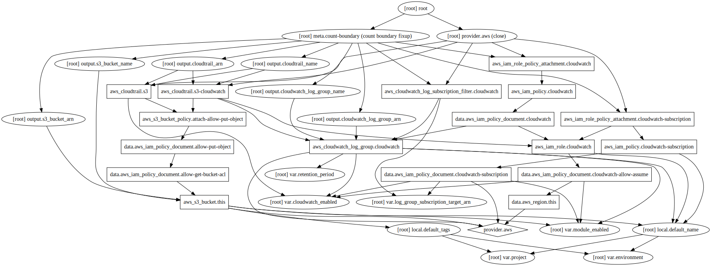

# Summary

Terraform module to setup AWS CloudTrail.

## Inputs

| Name | Description | Type | Default | Required |
|------|-------------|:----:|:-----:|:-----:|
| cloudwatch\_enabled | Trigger to enable/disable cloudwatch option | string | `false` | no |
| environment | Environment name will be used for naming resources in pattern %PROJECT_NAME%-%ENVIRONMENT_NAME% | string | `test` | no |
| log\_group\_subscription\_target\_arn | CloudWatch Log Group Subscription target ARN (disabled by default) | string | `None` | no |
| module\_enabled | Trigger to enable/disable module | string | `true` | no |
| project | Project name will be used for naming resources in pattern %PROJECT_NAME%-%ENVIRONMENT_NAME% | string | `project` | no |
| retention\_period | CloudWatch log retention period in days | string | `7` | no |

## Outputs

| Name | Description |
|------|-------------|
| cloudtrail\_arn | ARN of CloudTrail |
| cloudtrail\_name | Name of CloudTrail |
| cloudwatch\_log\_group\_arn | CloudWatch Log Group ARN |
| cloudwatch\_log\_group\_name | CloudWatch Log Group name |
| s3\_bucket\_arn | ARN of S3 bucket |
| s3\_bucket\_name | Name of S3 bucket |

## Module graph

